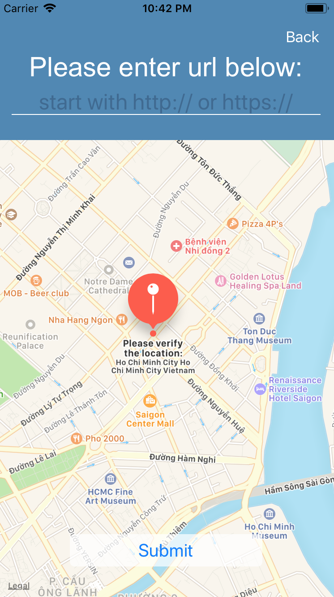

An application that posts user-generated location information to a shared map, pulling the locations of fellow Nanodegree students, with custom messages about themselves or their learning experience. Uses OAuth for authentication and custom animation for views transitions.

Data is displated either in a UITableView or on the Map via MapKit and custom MKAnnotations.

